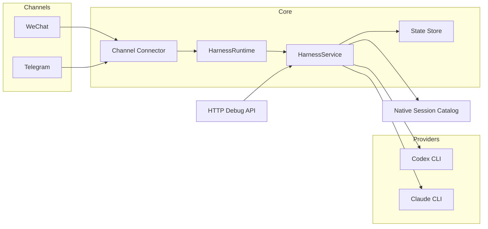

<p align="center">
  
</p>

<h1 align="center">Better Call Codex</h1>

<p align="center">
  <strong>Talk to local Codex / Claude from WeChat or Telegram<br/>Manage multiple sessions, switch workspaces, and attach existing native threads</strong>
</p>

<p align="center">
  <a href="#"></a>&nbsp;
  <a href="#"></a>&nbsp;
  <a href="#"></a>&nbsp;
  <a href="#"></a>
</p>

<p align="center">
  <a href="#"></a>&nbsp;
  <a href="#"></a>&nbsp;
  <a href="#"></a>&nbsp;
  <a href="#"></a>&nbsp;
  <a href="#"></a>
</p>

<p align="center">
  <kbd><a href="./README.md">中文说明</a></kbd>&ensp;|&ensp;<kbd><a href="./README.en.md">English</a></kbd>
</p>

<br/>

## What It Is

Better Call Codex is a **personal-computer-first** chat hub. It exposes local `codex` / `claude` CLIs to your phone chat apps so you can continue working from WeChat or Telegram.

> **One-line summary:** WeChat / Telegram → your Mac → Codex / Claude → result back to chat

### Typical use cases

| What you want | What Better Call Codex does |
|---|---|
| Continue a local Codex workflow from your phone | forwards chat messages to your local CLI |
| Keep multiple named sessions per project | built-in session management |
| Explicitly switch workspace or model | command-driven workflow, no hidden CLI state |
| Continue an existing native Codex thread | `attach` command resumes it |

### Recommended path today

```text
✅  WeChat + Codex + native session attach    ← most mature
🟡  Telegram + Codex                         ← implemented, waiting for live token validation
🟡  Claude provider                          ← adapter exists, production validation pending
```

---

## 3-Minute Quick Start

> **Prerequisites:** working WeChat bridge account · local `codex` · Node.js 20+ · `pnpm`

**1. Install**

```bash
cd /Users/a-znk/code/harness
PATH=/opt/homebrew/bin:$PATH /opt/homebrew/bin/pnpm install
cp .env.example .env
```

**2. Easiest way to get `WECHAT_BOT_TOKEN` and `WECHAT_BASE_URL`**

If your phone WeChat is already connected through OpenClaw, read the saved account file directly:

```bash
ls ~/.openclaw/openclaw-weixin/accounts
cat ~/.openclaw/openclaw-weixin/accounts/<your-account-file>.json
```

Look for:

- `token`
- `baseUrl`

Example:

```json
{
  "token": "4740ec87ef67@im.bot:......",
  "baseUrl": "https://ilinkai.weixin.qq.com"
}
```

Map them like this:

- `token` → `WECHAT_BOT_TOKEN`
- `baseUrl` → `WECHAT_BASE_URL`

If you use `wechat-agent-channel` instead of OpenClaw, you can also read:

```bash
cat ~/.wechat-agent-channel/wechat/account.json
```

**3. Minimum `.env`**

```env
HARNESS_ENABLE_WECHAT=true
HARNESS_LIVE_PROVIDERS=true
HARNESS_DEFAULT_PROVIDER=codex

WECHAT_BOT_TOKEN=<your-wechat-token>
WECHAT_BASE_URL=<your-wechat-bridge-url>
WECHAT_SYNC_CURSOR_FILE=./data/wechat-sync-cursor.txt

CODEX_COMMAND=/Applications/Codex.app/Contents/Resources/codex
```

**4. Start**

```bash
PATH=/opt/homebrew/bin:$PATH /opt/homebrew/bin/pnpm dev
```

**5. Verify**

```bash
curl http://127.0.0.1:4318/health
# → { "ok": true }
```

**6. Test in WeChat**

```text
导入项目 /Users/a-znk/code/harness
状态
Please summarize what this repository does
```

If you get a real Codex reply, deployment works.

---

## Deployment Paths

<table>
<tr>
<td width="50%">

### Path A: WeChat + Codex ✅

**Most complete and recommended.**

Best if you already connected WeChat to ClawBot / iLink / OpenClaw.

📄 [WeChat deployment guide (Chinese)](./docs/WECHAT_DEPLOYMENT.md)  
📄 [WeChat deployment guide (English)](./docs/WECHAT_DEPLOYMENT.en.md)

</td>
<td width="50%">

### Path B: Telegram + Codex 🟡

Implemented in code, but still waiting for real token validation.

Minimum config:

```env
HARNESS_ENABLE_TELEGRAM=true
HARNESS_LIVE_PROVIDERS=true
HARNESS_DEFAULT_PROVIDER=codex
TELEGRAM_BOT_TOKEN=<your-token>
```

</td>
</tr>
</table>

---

## Current Capability Level

<table>
<tr><td>

**Working now**
- real WeChat connector (ClawBot / iLink compatible)
- real Codex execution
- multiple sessions per workspace
- native Codex session discovery / attach / switch
- model override commands
- workspace import / switch from chat
- Chinese WeChat aliases
- allowlists for WeChat and Telegram
- local HTTP debug API

</td><td>

**Implemented, waiting for production validation**
- Telegram Bot API connector
- Claude provider adapter

**Planned**
- real Telegram token validation
- Claude native session discovery
- provider preset / reasoning profile
- OpenClaw / external transcript import
- streaming replies and typing signals
- allowlist management commands

</td></tr>
</table>

---

## Architecture



```text
src/
├── app/            # application entry
├── auth/           # auth & allowlists
├── channels/       # WeChat / Telegram connectors
├── core/           # business rules and commands
├── domain/         # domain models
├── native/         # native session discovery
├── providers/      # Codex / Claude adapters
├── runtime/        # connector startup and dispatch
├── storage/        # file and memory state stores
tests/              # test suites
docs/               # deployment docs
```

---

## Command Reference

<details>
<summary><b>Status and workspace</b></summary>

| Command | WeChat alias |
|---|---|
| `/status` | `状态` |
| `/workspace list` | `项目列表` |
| `/workspace use <slug>` | `切换项目 <slug>` |
| `/workspace import <path>` | `导入项目 <path>` |

</details>

<details>
<summary><b>Provider and model</b></summary>

| Command | WeChat alias |
|---|---|
| `/provider list` | none |
| `/provider current` | none |
| `/provider use codex` | `切换模型 codex` |
| `/provider use claude` | `切换模型 claude` |
| `/provider model current` | `当前模型` |
| `/provider model use <model>` | `切换具体模型 <model>` |
| `/provider model clear` | none |

</details>

<details>
<summary><b>Better Call Codex sessions</b></summary>

| Command | WeChat alias |
|---|---|
| `/session list` | `会话列表` |
| `/session new [name]` | `新建会话 [name]` |
| `/session use <id|name|index>` | `切换会话 <id|name|index>` |
| `/session archive <id|name|index>` | none |
| `/new [name]` | `新任务 [name]` |
| `/switch <id|name|index>` | `切换会话 <id|name|index>` |

</details>

<details>
<summary><b>Native sessions</b></summary>

| Command | WeChat alias |
|---|---|
| `/session attach <codex|claude> <native-id> [name]` | none |
| `/session native list current` | `当前目录会话` / `原生会话列表` |
| `/session native list all` | `所有原生会话` |
| `/session native use [current|all] <index|native-id>` | `切换原生会话 <index|native-id>` |

</details>

---

## Troubleshooting

### `pnpm` or `node` not found

Use:

```bash
PATH=/opt/homebrew/bin:$PATH /opt/homebrew/bin/pnpm dev
```

### WeChat starts but there is no reply

Check:

1. `HARNESS_ENABLE_WECHAT=true`
2. `HARNESS_LIVE_PROVIDERS=true`
3. `WECHAT_BOT_TOKEN` is correct
4. `WECHAT_BASE_URL` is correct
5. `WECHAT_ALLOW_FROM` is not blocking you
6. local `codex` works directly

### `Access denied`

The allowlist is blocking the chat.

Check:

- `WECHAT_ALLOW_FROM`
- `TELEGRAM_ALLOW_FROM`
- `TELEGRAM_ALLOW_CHATS`

### Native session list looks noisy

Prefer:

```text
/session native list current
```

It filters by current workspace and hides noisy subagent sessions by default.

---

## Validation

```bash
PATH=/opt/homebrew/bin:$PATH /opt/homebrew/bin/pnpm check
PATH=/opt/homebrew/bin:$PATH /opt/homebrew/bin/pnpm build
```

---

## Detailed Docs

- [WeChat deployment guide (Chinese)](./docs/WECHAT_DEPLOYMENT.md)
- [WeChat deployment guide (English)](./docs/WECHAT_DEPLOYMENT.en.md)
