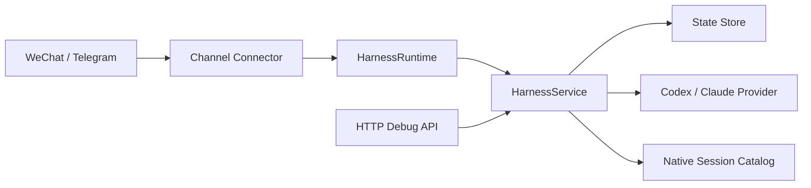

[](/Users/a-znk/code/harness/README.md)
[](/Users/a-znk/code/harness/README.en.md)

# Better Call Codex

Better Call Codex 是一个“个人电脑优先”的聊天中枢，让你可以直接在微信或 Telegram 里和本机上的 `codex` / `claude` 对话。

它解决的是这类场景：

- 你已经在电脑上装好了 `codex` 或 `claude`
- 你希望在手机上继续和它协作
- 你希望一个项目里能有多个命名会话
- 你希望显式切换工作目录、模型和原生会话，而不是依赖隐藏的 CLI 状态

目前最成熟的路径是：

- 微信 + Codex + 原生会话接管

Telegram 支持已经写完并有测试，但还没有做真实 bot token 的线上联调。

## 这个项目能做什么

Better Call Codex 把三件事明确分开：

- `workspace`
  你允许它访问的本地项目目录
- `provider session`
  你电脑上真实存在的 Codex 或 Claude 原生会话
- `channel binding`
  一个具体的微信会话或 Telegram chat/topic

这意味着同一个微信会话可以同时做到：

1. 选中工作区 `harness`
2. 保留一个当前 `codex` 会话
3. 保留一个当前 `claude` 会话
4. 在它们之间来回切换而不丢状态
5. 把已经存在的原生 Codex thread 接进来继续聊

## 当前完成度

### 已经可用

- 微信真实接入，兼容 ClawBot / iLink
- Codex 真实执行
- 每个工作区支持多会话
- 原生 Codex 会话发现、接管、切换
- 模型切换命令
- 聊天内导入工作区和切换工作区
- 微信中文命令别名
- 微信和 Telegram allowlist
- 本地 HTTP 调试 API

### 已实现但还没做完整生产验证

- Telegram Bot API connector
- Claude provider adapter

### 还没做完

- Telegram 真实 token 联调
- Claude 原生会话发现
- provider preset / 推理档位命令
- OpenClaw / 外部 transcript 导入
- 流式输出和 typing 状态
- allowlist 的管理型命令

## 最快上手路径

如果你只想最快跑起来，建议直接走：

- 微信
- Codex
- 当前这台电脑

如果你已经具备以下条件，几分钟内就能用起来：

- 已有可用的微信桥接账号
- 本机 `codex` 可运行
- 本机 `node` 和 `pnpm` 可运行

### 快速启动

```bash
cd /Users/a-znk/code/harness
PATH=/opt/homebrew/bin:$PATH /opt/homebrew/bin/pnpm install
cp .env.example .env
```

然后至少把 `.env` 改成这样：

```env
HARNESS_ENABLE_WECHAT=true
HARNESS_LIVE_PROVIDERS=true
HARNESS_DEFAULT_PROVIDER=codex

WECHAT_BOT_TOKEN=你的微信token
WECHAT_BASE_URL=https://你的微信桥地址
WECHAT_SYNC_CURSOR_FILE=./data/wechat-sync-cursor.txt

CODEX_COMMAND=/Applications/Codex.app/Contents/Resources/codex
```

启动：

```bash
cd /Users/a-znk/code/harness
PATH=/opt/homebrew/bin:$PATH /opt/homebrew/bin/pnpm dev
```

检查健康状态：

```bash
curl http://127.0.0.1:4318/health
```

如果返回：

```json
{ "ok": true }
```

说明本地服务已经起来了。

然后去微信里发：

```text
导入项目 /Users/a-znk/code/harness
```

再发：

```text
状态
```

再发：

```text
请帮我总结这个仓库是做什么的
```

如果你收到了真实 Codex 回复，就说明部署成功。

## 选择你的部署路径

### 路线 A：微信 + Codex

这是目前最完整、最推荐的路线。

适合你：

- 已经把微信接到了 OpenClaw / ClawBot / iLink
- 想在手机上和本地 Codex 对话
- 想接管现有原生 Codex 会话

详细部署说明：

- [微信部署说明（中文）](./docs/WECHAT_DEPLOYMENT.md)
- [WeChat Deployment Guide (English)](./docs/WECHAT_DEPLOYMENT.en.md)

### 路线 B：Telegram + Codex

这条路线代码已经有了，但建议你目前把它视为“下一步生产验证目标”。

适合你：

- 已经有 Telegram bot token
- 更偏好标准 Bot API，而不是微信桥 API

最小配置：

```env
HARNESS_ENABLE_TELEGRAM=true
HARNESS_LIVE_PROVIDERS=true
HARNESS_DEFAULT_PROVIDER=codex

TELEGRAM_BOT_TOKEN=你的telegram-token
TELEGRAM_UPDATE_OFFSET_FILE=./data/telegram-update-offset.json
```

可选安全过滤：

```env
TELEGRAM_ALLOW_FROM=123456789
TELEGRAM_ALLOW_CHATS=-1001234567890
```

## 前置条件

### 必需

- macOS 或其他支持 Node 的环境
- Node.js 20+
- `pnpm`
- 本机能运行 `codex`

### 可选

- 如果要用 Claude，需要本机可运行 `claude`
- 如果要用 Telegram，需要 Telegram bot token
- 如果要用微信，需要 ClawBot / iLink 兼容桥接

### 本地检查

```bash
codex --version
PATH=/opt/homebrew/bin:$PATH /opt/homebrew/bin/node --version
PATH=/opt/homebrew/bin:$PATH /opt/homebrew/bin/pnpm --version
```

如果你在 Apple Silicon macOS 上遇到 `node` 或 `pnpm` 找不到，优先用上面这种 Homebrew 路径写法。

## 安装

```bash
cd /Users/a-znk/code/harness
PATH=/opt/homebrew/bin:$PATH /opt/homebrew/bin/pnpm install
```

项目验证：

```bash
PATH=/opt/homebrew/bin:$PATH /opt/homebrew/bin/pnpm check
PATH=/opt/homebrew/bin:$PATH /opt/homebrew/bin/pnpm build
```

## 环境变量说明

项目启动时会自动读取 `.env`。

从这里开始：

```bash
cp .env.example .env
```

### 核心配置

```env
HARNESS_PORT=4318
HARNESS_STATE_FILE=./data/harness-state.json
HARNESS_DEFAULT_PROVIDER=codex
HARNESS_LIVE_PROVIDERS=false
```

含义：

- `HARNESS_PORT`
  本地 HTTP 调试 API 端口
- `HARNESS_STATE_FILE`
  用来保存 workspace、session 和 binding 的 JSON 状态文件
- `HARNESS_DEFAULT_PROVIDER`
  新 binding 默认使用的 provider
- `HARNESS_LIVE_PROVIDERS`
  `false` 表示 dry-run，`true` 表示真正调用本地 CLI

### 微信配置

```env
HARNESS_ENABLE_WECHAT=false
WECHAT_BOT_TOKEN=
WECHAT_BASE_URL=
WECHAT_POLL_TIMEOUT_MS=25000
WECHAT_SYNC_CURSOR_FILE=./data/wechat-sync-cursor.txt
WECHAT_ALLOW_FROM=
```

含义：

- `HARNESS_ENABLE_WECHAT`
  是否启用微信 connector
- `WECHAT_BOT_TOKEN`
  微信桥 token
- `WECHAT_BASE_URL`
  微信桥 base URL
- `WECHAT_POLL_TIMEOUT_MS`
  长轮询超时
- `WECHAT_SYNC_CURSOR_FILE`
  保存微信同步 cursor，避免重启后重复消费旧消息
- `WECHAT_ALLOW_FROM`
  允许访问的微信 senderId，多个用逗号分隔

### Telegram 配置

```env
HARNESS_ENABLE_TELEGRAM=false
TELEGRAM_BOT_TOKEN=
TELEGRAM_POLL_TIMEOUT_MS=25000
TELEGRAM_UPDATE_OFFSET_FILE=./data/telegram-update-offset.json
TELEGRAM_ALLOW_FROM=
TELEGRAM_ALLOW_CHATS=
```

含义：

- `HARNESS_ENABLE_TELEGRAM`
  是否启用 Telegram connector
- `TELEGRAM_BOT_TOKEN`
  Telegram bot token
- `TELEGRAM_POLL_TIMEOUT_MS`
  长轮询超时
- `TELEGRAM_UPDATE_OFFSET_FILE`
  保存 Telegram update offset
- `TELEGRAM_ALLOW_FROM`
  允许访问的 Telegram 用户 ID
- `TELEGRAM_ALLOW_CHATS`
  允许访问的 Telegram chat ID

### Provider 配置

```env
CODEX_COMMAND=codex
CODEX_MODEL=
CODEX_TIMEOUT_MS=120000
CODEX_SANDBOX=workspace-write
CODEX_APPROVAL=never

CLAUDE_COMMAND=claude
CLAUDE_MODEL=
CLAUDE_TIMEOUT_MS=120000
CLAUDE_PERMISSION_MODE=default
```

## 安全建议

这个项目之所以强，是因为它真的能控制你电脑上的本地 coding agent。

所以不要把它当成一个可以随便公开暴露的 bot。

### 最低建议

微信：

```env
WECHAT_ALLOW_FROM=你的微信senderId
```

Telegram：

```env
TELEGRAM_ALLOW_FROM=123456789
TELEGRAM_ALLOW_CHATS=-1001234567890
```

### allowlist 规则

- 如果 `WECHAT_ALLOW_FROM` 为空，那么任何能到达这个微信桥的 sender 都可能访问
- 如果 `TELEGRAM_ALLOW_FROM` 为空，那么任何 Telegram 用户都可能访问
- 如果 `TELEGRAM_ALLOW_CHATS` 为空，那么任何 Telegram chat 都可能访问
- 如果 Telegram 的 user allowlist 和 chat allowlist 都设置了，那么两者都必须命中

如果只是你自己用，建议至少先把 allowlist 配上再开始长期使用。

## 如何运行

### 开发模式

```bash
PATH=/opt/homebrew/bin:$PATH /opt/homebrew/bin/pnpm dev
```

### 构建

```bash
PATH=/opt/homebrew/bin:$PATH /opt/homebrew/bin/pnpm build
```

### 更接近部署的本地运行

```bash
PATH=/opt/homebrew/bin:$PATH /opt/homebrew/bin/node dist/src/server.js
```

## 第一次成功运行的检查清单

满足这些，就说明你已经进入“可用状态”：

- `pnpm check` 通过
- `pnpm build` 通过
- `.env` 已存在并填了正确 token/base URL
- 服务启动时没有立刻报配置错误
- `curl http://127.0.0.1:4318/health` 返回 `{ "ok": true }`
- 聊天软件里能收到真实 Codex 回复

## 核心概念

### Workspace

workspace 就是一个本地项目目录。

例如：

- `/Users/a-znk/code/harness`
- `/Users/a-znk/code/taskvision`

可以直接在聊天里导入：

```text
/workspace import /Users/a-znk/code/harness
```

微信里可以发：

```text
导入项目 /Users/a-znk/code/harness
```

### Session

session 是 Better Call Codex 自己维护的会话记录。

它会记录：

- workspace
- provider
- native provider session id
- 最近输入/输出/错误
- turn 次数

### Native session

native session 是 provider 自己的真实会话。

例如：

- 一个真实的 Codex thread id
- 一个真实的 Claude session id

Better Call Codex 现在已经可以发现并接管原生 Codex 会话。

## 命令说明

### 状态与工作区

```text
/status
/workspace list
/workspace use <slug>
/workspace import <path>
```

微信中文别名：

```text
状态
项目列表
切换项目 <slug>
导入项目 <path>
```

### Provider 与模型

```text
/provider list
/provider current
/provider use codex
/provider use claude
/provider model current
/provider model use gpt-5-codex
/provider model clear
```

微信中文别名：

```text
切换模型 codex
切换模型 claude
当前模型
切换具体模型 gpt-5-codex
```

### Better Call Codex 自己的会话

```text
/session list
/session new [name]
/session use <id|name|index>
/session archive <id|name|index>
/new [name]
/switch <id|name|index>
```

微信中文别名：

```text
新建会话 修复登录
会话列表
切换会话 1
切换会话 修复登录
```

### 原生会话工作流

直接接入一个已知原生会话：

```text
/session attach codex <native-id> [name]
/session attach claude <native-id> [name]
```

列出可发现的原生会话：

```text
/session native list current
/session native list all
```

根据列表里的索引或原生 id 直接切换：

```text
/session native use 1
/session native use current 1
/session native use all 12
/session native use 019d1a6c-a89f-7653-88b1-0ede9ece8d08
```

微信中文别名：

```text
原生会话列表
所有原生会话
当前目录会话
切换原生会话 1
```

### 原生会话列表是怎么工作的

`/session native list current`：

- 先按当前 workspace 过滤
- 把精确命中的 cwd 和子目录命中分开
- 默认隐藏 subagent 噪音
- 已 attach 的会话优先显示

`/session native list all`：

- 按 `cwd` 分组
- 默认隐藏 subagent
- 适合从别的项目里导入一个历史会话

## HTTP 调试 API

这个项目暴露了一个小型本地 HTTP API，主要用于调试和模拟消息。

### 健康检查

```bash
curl http://127.0.0.1:4318/health
```

### 查看完整状态

```bash
curl http://127.0.0.1:4318/state
```

### 手动注册 workspace

```bash
curl -X POST http://127.0.0.1:4318/admin/workspaces \
  -H 'content-type: application/json' \
  -d '{
    "slug": "taskvision",
    "displayName": "Taskvision",
    "rootPath": "/Users/a-znk/code/taskvision",
    "allowedProviders": ["codex", "claude"]
  }'
```

### 模拟微信消息

```bash
curl -X POST http://127.0.0.1:4318/channels/wechat/inbound \
  -H 'content-type: application/json' \
  -d '{
    "senderId": "alice@im.wechat",
    "conversationId": "thread-1",
    "contextToken": "ctx-123",
    "text": "/status"
  }'
```

### 模拟 Telegram 消息

```bash
curl -X POST http://127.0.0.1:4318/channels/telegram/inbound \
  -H 'content-type: application/json' \
  -d '{
    "chatId": 1001,
    "topicId": 12,
    "userId": 42,
    "replyToMessageId": 99,
    "text": "/status"
  }'
```

## 架构概览

### 主流程



### 主要目录

- `src/core`
  业务规则、命令、workspace/session 语义
- `src/channels`
  真实渠道 connector 和 payload 映射
- `src/runtime`
  connector 启动与 outbound 分发
- `src/providers`
  Codex 和 Claude 执行适配
- `src/native`
  原生会话发现
- `src/storage`
  文件和内存 state store

## 常见问题

### `pnpm` 或 `node` 找不到

优先用 Homebrew 路径：

```bash
PATH=/opt/homebrew/bin:$PATH /opt/homebrew/bin/pnpm dev
```

### 微信启动了但没有回复

按顺序检查：

1. `HARNESS_ENABLE_WECHAT=true`
2. `HARNESS_LIVE_PROVIDERS=true`
3. `WECHAT_BOT_TOKEN` 正确
4. `WECHAT_BASE_URL` 正确
5. `WECHAT_ALLOW_FROM` 没把你自己挡掉
6. 本机 `codex` 本身能直接运行

### Telegram 启动了但没反应

按顺序检查：

1. `HARNESS_ENABLE_TELEGRAM=true`
2. `TELEGRAM_BOT_TOKEN` 正确
3. `TELEGRAM_ALLOW_FROM` 和 `TELEGRAM_ALLOW_CHATS` 没把你挡掉
4. 你的 bot 本身在 Telegram 里可以收到消息

### 聊天里提示 `Access denied`

这是 allowlist 在工作。

检查：

- `WECHAT_ALLOW_FROM`
- `TELEGRAM_ALLOW_FROM`
- `TELEGRAM_ALLOW_CHATS`

### 原生会话列表太乱

优先用：

```text
/session native list current
```

不要一上来就用：

```text
/session native list all
```

因为 `current` 会按 workspace 过滤，并默认隐藏 subagent 噪音。

### `attach` 成功了但后续消息失败

常见原因：

- native id 不对
- provider CLI 行为变了
- 当前 workspace 和原会话的 cwd 不符合你的预期
- Codex 或 Claude 已经无法 resume 那个原生会话

## 验证命令

项目标准验证命令：

```bash
PATH=/opt/homebrew/bin:$PATH /opt/homebrew/bin/pnpm check
PATH=/opt/homebrew/bin:$PATH /opt/homebrew/bin/pnpm build
```

## 目录结构

```text
src/app
src/auth
src/channels
src/core
src/domain
src/native
src/providers
src/runtime
src/storage
tests
docs
agent
```

## 详细文档

- [微信部署说明（中文）](./docs/WECHAT_DEPLOYMENT.md)
- [WeChat Deployment Guide (English)](./docs/WECHAT_DEPLOYMENT.en.md)

## Roadmap

当前最值得继续做的事情：

1. 用真实 Telegram token 做联调
2. 增加 allowlist 管理型命令
3. 增加 provider preset / 推理档位抽象
4. 增加 Claude 原生会话发现
5. 增加 transcript 导入和迁移能力
6. 增加 streaming / typing / 更好的交付体验
