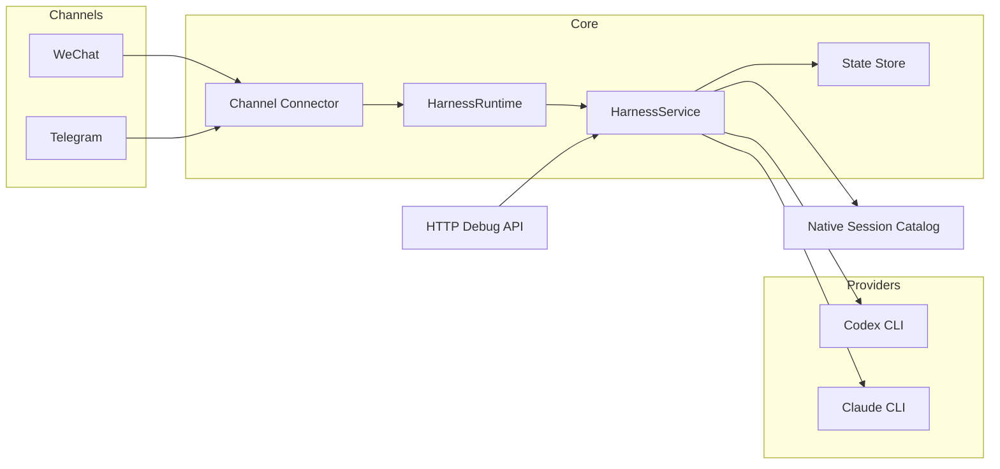

<p align="center">
  
</p>

<h1 align="center">Better Call Codex</h1>

<p align="center">
  <strong>在微信或 Telegram 里直接连接你电脑上的 Codex / Claude<br/>管理多会话、切换工作区，并接管已有原生会话</strong>
</p>

<p align="center">
  <a href="#"></a>&nbsp;
  <a href="#"></a>&nbsp;
  <a href="#"></a>&nbsp;
  <a href="#"></a>
</p>

<p align="center">
  <a href="#"></a>&nbsp;
  <a href="#"></a>&nbsp;
  <a href="#"></a>&nbsp;
  <a href="#"></a>&nbsp;
  <a href="#"></a>
</p>

<p align="center">
  <kbd><a href="README.md">中文说明</a></kbd>&ensp;|&ensp;<kbd><a href="README.en.md">English</a></kbd>
</p>

<br/>

## 它是什么

Better Call Codex 是一个**个人电脑优先**的聊天中枢。它把本机上的 `codex` / `claude` CLI 暴露给你的手机聊天软件，让你随时随地继续编码对话。

> **一句话总结：** 微信/Telegram → 你的 Mac → Codex/Claude → 代码回复推回手机。

### 适用场景

| 你想做的 | Better Call Codex 怎么帮你 |
|---|---|
| 在手机上继续和本地 Codex 对话 | 微信/Telegram 直接转发到本机 CLI |
| 一个项目里保留多个命名会话 | 内置 session 管理，互不干扰 |
| 显式切换工作目录、模型 | 命令行式控制，不依赖隐藏状态 |
| 接管已有的原生 Codex thread | `attach` 命令直接续上 |

### 当前推荐路径

```
✅  微信 + Codex + 原生会话接管     ← 最成熟
🟡  Telegram + Codex               ← 代码完成，待真实联调
🟡  Claude provider                ← adapter 已实现，待生产验证
```

---

## 核心概念

Better Call Codex 把三件事明确分开，互不耦合：

```
┌─────────────┐     ┌──────────────────┐     ┌─────────────────┐
│  Workspace   │     │ Provider Session  │     │ Channel Binding  │
│  本地项目目录 │ ──▶ │ Codex/Claude 会话 │ ◀── │ 微信/TG 聊天窗口  │
└─────────────┘     └──────────────────┘     └─────────────────┘
```

这意味着同一个微信会话可以同时：

1. 选中工作区 `harness`
2. 保留一个当前 Codex 会话 + 一个当前 Claude 会话
3. 在它们之间来回切换而不丢状态
4. 把已经存在的原生 Codex thread 接进来继续聊

---

## 快速开始

> **前置条件：** 可用的微信桥接账号 · 本机 `codex` 可运行 · Node.js 20+ · `pnpm`

**1. 安装依赖**

```bash
pnpm install
```

**2. 创建配置**

```bash
cp .env.example .env
```

最小化 `.env`：

```env
HARNESS_ENABLE_WECHAT=true
HARNESS_LIVE_PROVIDERS=true
HARNESS_DEFAULT_PROVIDER=codex

WECHAT_BOT_TOKEN=<你的微信token>
WECHAT_BASE_URL=https://<你的微信桥地址>
WECHAT_SYNC_CURSOR_FILE=./data/wechat-sync-cursor.txt

CODEX_COMMAND=/Applications/Codex.app/Contents/Resources/codex
```

**3. 启动**

```bash
pnpm dev
```

**4. 验证**

```bash
curl http://127.0.0.1:4318/health
# → { "ok": true }
```

**5. 在微信里试试**

```
导入项目 /path/to/your/project
状态
请帮我总结这个仓库是做什么的
```

收到真实 Codex 回复 → 部署成功。

---

## 部署路线

<table>
<tr>
<td width="50%">

### 路线 A：微信 + Codex ✅

**最完整、最推荐。**

适合已经把微信接到 ClawBot / iLink 的用户。

📄 [微信部署说明（中文）](./docs/WECHAT_DEPLOYMENT.md)<br/>
📄 [WeChat Deployment (English)](./docs/WECHAT_DEPLOYMENT.en.md)

</td>
<td width="50%">

### 路线 B：Telegram + Codex 🟡

代码已完成，待真实 token 联调。

最小配置：

```env
HARNESS_ENABLE_TELEGRAM=true
HARNESS_LIVE_PROVIDERS=true
HARNESS_DEFAULT_PROVIDER=codex
TELEGRAM_BOT_TOKEN=<your-token>
```

</td>
</tr>
</table>

---

## 功能完成度

<table>
<tr><td>

**已可用**
- 微信真实接入（ClawBot / iLink 兼容）
- Codex 真实执行
- 每个工作区支持多会话
- 原生 Codex 会话发现、接管、切换
- 模型切换命令
- 聊天内导入 / 切换工作区
- 微信中文命令别名
- 微信和 Telegram allowlist
- 本地 HTTP 调试 API

</td><td>

**已实现，待生产验证**
- Telegram Bot API connector
- Claude provider adapter

**规划中**
- Telegram 真实 token 联调
- Claude 原生会话发现
- Provider preset / 推理档位
- OpenClaw / 外部 transcript 导入
- 流式输出和 typing 状态
- Allowlist 管理命令

</td></tr>
</table>

---

## 架构



```
src/
├── app/            # 应用入口
├── auth/           # 鉴权 & allowlist
├── channels/       # WeChat / Telegram connector
├── core/           # 业务规则、命令、workspace/session 语义
├── domain/         # 领域模型
├── native/         # 原生会话发现
├── providers/      # Codex / Claude 执行适配
├── runtime/        # Connector 启动与 outbound 分发
├── storage/        # 文件和内存 state store
tests/              # 测试套件
docs/               # 部署文档
```

---

## 命令参考

<details>
<summary><b>状态与工作区</b></summary>

| 命令 | 微信别名 |
|---|---|
| `/status` | `状态` |
| `/workspace list` | `项目列表` |
| `/workspace use <slug>` | `切换项目 <slug>` |
| `/workspace import <path>` | `导入项目 <path>` |

</details>

<details>
<summary><b>Provider 与模型</b></summary>

| 命令 | 微信别名 |
|---|---|
| `/provider list` | — |
| `/provider current` | — |
| `/provider use codex` | `切换模型 codex` |
| `/provider use claude` | `切换模型 claude` |
| `/provider model current` | `当前模型` |
| `/provider model use gpt-5-codex` | `切换具体模型 gpt-5-codex` |
| `/provider model clear` | — |

</details>

<details>
<summary><b>会话管理</b></summary>

| 命令 | 微信别名 |
|---|---|
| `/session list` | `会话列表` |
| `/session new [name]` | `新建会话 [name]` |
| `/session use <id\|name\|index>` | `切换会话 <id\|name\|index>` |
| `/session archive <id\|name\|index>` | — |
| `/new [name]` | — |
| `/switch <id\|name\|index>` | — |

</details>

<details>
<summary><b>原生会话</b></summary>

| 命令 | 微信别名 |
|---|---|
| `/session attach codex <native-id> [name]` | — |
| `/session attach claude <native-id> [name]` | — |
| `/session native list current` | `当前目录会话` |
| `/session native list all` | `所有原生会话` / `原生会话列表` |
| `/session native use <index\|id>` | `切换原生会话 <index>` |

**原生会话列表逻辑：**
- `current` → 按当前 workspace 过滤，精确/子目录分开，隐藏 subagent 噪音，已 attach 优先
- `all` → 按 `cwd` 分组，隐藏 subagent，适合跨项目导入历史会话

</details>

---

## 环境变量

<details>
<summary><b>完整环境变量参考</b></summary>

### 核心

| 变量 | 默认值 | 说明 |
|---|---|---|
| `HARNESS_PORT` | `4318` | HTTP 调试 API 端口 |
| `HARNESS_STATE_FILE` | `./data/harness-state.json` | 状态持久化路径 |
| `HARNESS_DEFAULT_PROVIDER` | `codex` | 新 binding 默认 provider |
| `HARNESS_LIVE_PROVIDERS` | `false` | `true` = 真实调用 CLI；`false` = dry-run |

### 微信

| 变量 | 说明 |
|---|---|
| `HARNESS_ENABLE_WECHAT` | 是否启用 |
| `WECHAT_BOT_TOKEN` | 微信桥 token |
| `WECHAT_BASE_URL` | 微信桥 base URL |
| `WECHAT_POLL_TIMEOUT_MS` | 长轮询超时（默认 25000） |
| `WECHAT_SYNC_CURSOR_FILE` | 同步 cursor 路径 |
| `WECHAT_ALLOW_FROM` | 允许的 senderId，逗号分隔 |

### Telegram

| 变量 | 说明 |
|---|---|
| `HARNESS_ENABLE_TELEGRAM` | 是否启用 |
| `TELEGRAM_BOT_TOKEN` | Bot token |
| `TELEGRAM_POLL_TIMEOUT_MS` | 长轮询超时（默认 25000） |
| `TELEGRAM_UPDATE_OFFSET_FILE` | Update offset 路径 |
| `TELEGRAM_ALLOW_FROM` | 允许的用户 ID |
| `TELEGRAM_ALLOW_CHATS` | 允许的 chat ID |

### Provider

| 变量 | 说明 |
|---|---|
| `CODEX_COMMAND` | Codex CLI 路径（默认 `codex`） |
| `CODEX_MODEL` | 指定模型 |
| `CODEX_TIMEOUT_MS` | 超时（默认 120000） |
| `CODEX_SANDBOX` | 沙箱模式（默认 `workspace-write`） |
| `CODEX_APPROVAL` | 审批模式（默认 `never`） |
| `CLAUDE_COMMAND` | Claude CLI 路径（默认 `claude`） |
| `CLAUDE_MODEL` | 指定模型 |
| `CLAUDE_TIMEOUT_MS` | 超时（默认 120000） |
| `CLAUDE_PERMISSION_MODE` | 权限模式（默认 `default`） |

</details>

---

## HTTP 调试 API

<details>
<summary><b>API 端点列表</b></summary>

```bash
# 健康检查
curl http://127.0.0.1:4318/health

# 完整状态
curl http://127.0.0.1:4318/state

# 注册 workspace
curl -X POST http://127.0.0.1:4318/admin/workspaces \
  -H 'content-type: application/json' \
  -d '{"slug":"myproject","displayName":"My Project","rootPath":"/path/to/project","allowedProviders":["codex","claude"]}'

# 模拟微信消息
curl -X POST http://127.0.0.1:4318/channels/wechat/inbound \
  -H 'content-type: application/json' \
  -d '{"senderId":"alice@im.wechat","conversationId":"thread-1","contextToken":"ctx-123","text":"/status"}'

# 模拟 Telegram 消息
curl -X POST http://127.0.0.1:4318/channels/telegram/inbound \
  -H 'content-type: application/json' \
  -d '{"chatId":1001,"topicId":12,"userId":42,"replyToMessageId":99,"text":"/status"}'
```

</details>

---

## 安全建议

> ⚠️ Better Call Codex 能真实控制你电脑上的 coding agent。**不要将其公开暴露。**

**最低安全配置：**

```env
# 微信
WECHAT_ALLOW_FROM=<你的微信senderId>

# Telegram
TELEGRAM_ALLOW_FROM=<你的用户ID>
TELEGRAM_ALLOW_CHATS=<你的chatID>
```

**Allowlist 规则：**
- 为空 = 不限制（任何人都能访问）
- Telegram 同时设置 user + chat allowlist 时，两者都必须命中
- 建议个人使用前先配好 allowlist

---

## 常见问题

<details>
<summary><code>pnpm</code> 或 <code>node</code> 找不到</summary>

Apple Silicon macOS 上使用 Homebrew 路径：

```bash
PATH=/opt/homebrew/bin:$PATH pnpm dev
```
</details>

<details>
<summary>微信启动了但没有回复</summary>

依次检查：`HARNESS_ENABLE_WECHAT=true` → `HARNESS_LIVE_PROVIDERS=true` → token 正确 → base URL 正确 → allowlist 没挡住自己 → 本机 `codex` 能直接运行。
</details>

<details>
<summary>聊天里提示 <code>Access denied</code></summary>

Allowlist 在工作。检查 `WECHAT_ALLOW_FROM` / `TELEGRAM_ALLOW_FROM` / `TELEGRAM_ALLOW_CHATS`。
</details>

<details>
<summary>原生会话列表太乱</summary>

优先使用 `/session native list current`，它会按 workspace 过滤并隐藏 subagent 噪音。
</details>

<details>
<summary><code>attach</code> 成功但后续消息失败</summary>

常见原因：native id 不对、provider CLI 行为变了、workspace 与原会话 cwd 不匹配、原生会话已无法 resume。
</details>

---

## 验证

```bash
pnpm check   # 类型检查 + lint
pnpm build   # 构建
pnpm test    # 运行测试（34 passing）
```

---

<p align="center">
  <sub>Built for personal use. Ship your own coding agent bridge.</sub>
</p>
