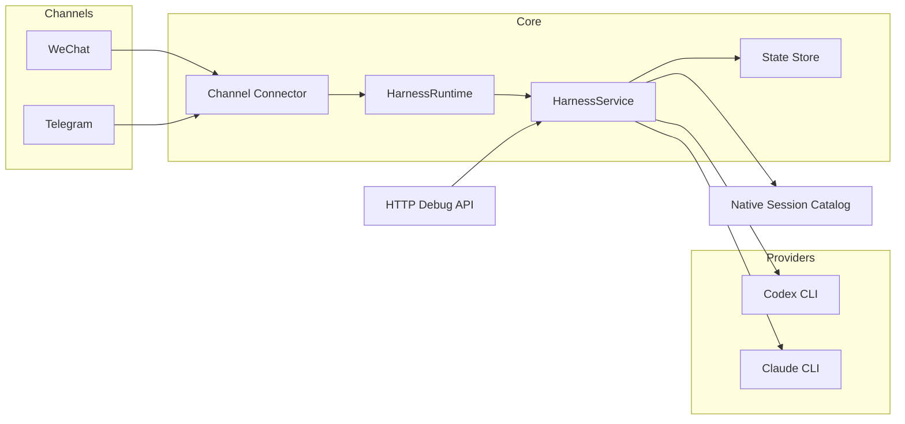

<p align="center">
  
</p>

<h1 align="center">Better Call Codex</h1>

<p align="center">
  <strong>在微信或 Telegram 里直接连接你电脑上的 Codex / Claude<br/>管理多会话、切换工作区，并接管已有原生会话</strong>
</p>

<p align="center">
  <a href="#"></a>&nbsp;
  <a href="#"></a>&nbsp;
  <a href="#"></a>&nbsp;
  <a href="#"></a>
</p>

<p align="center">
  <a href="#"></a>&nbsp;
  <a href="#"></a>&nbsp;
  <a href="#"></a>&nbsp;
  <a href="#"></a>&nbsp;
  <a href="#"></a>
</p>

<p align="center">
  <kbd><a href="./README.md">中文说明</a></kbd>&ensp;|&ensp;<kbd><a href="./README.en.md">English</a></kbd>
</p>

<br/>

## 它是什么

Better Call Codex 是一个**个人电脑优先**的聊天中枢。它把你电脑上的 `codex` / `claude` CLI 变成一个可通过微信或 Telegram 使用的远程编码助手。

它适合这些场景：

- 你已经在电脑上装好了 `codex` 或 `claude`
- 你希望在手机上继续和本地 AI 协作
- 你希望一个项目里保留多个命名会话
- 你希望显式切换工作区、模型和原生会话，而不是依赖隐藏的 CLI 状态

> **一句话理解：** 微信 / Telegram → 你的电脑 → Codex / Claude → 结果回到聊天窗口

### 当前推荐路径

```text
✅ 微信 + Codex + 原生会话接管      ← 最成熟
🟡 Telegram + Codex                ← 代码已完成，待真实 token 联调
🟡 Claude provider                ← adapter 已实现，待生产验证
```

---

## 3 分钟快速上手

如果你现在只想快速跑起来，请直接按下面做。

### 前置条件

- 已有可用的微信桥接账号
- 本机 `codex` 可运行
- 本机有 `node` 和 `pnpm`

### 1. 安装依赖

```bash
cd /Users/a-znk/code/harness
PATH=/opt/homebrew/bin:$PATH /opt/homebrew/bin/pnpm install
cp .env.example .env
```

### 2. 最简单拿到 `WECHAT_BOT_TOKEN` 和 `WECHAT_BASE_URL`

如果你**已经通过 OpenClaw 接好了微信**，最简单的方法不是去想这个 token 是什么，而是直接读本机保存好的账号文件：

```bash
ls ~/.openclaw/openclaw-weixin/accounts
cat ~/.openclaw/openclaw-weixin/accounts/<你的账号文件名>.json
```

你要找的是两个字段：

- `token`
- `baseUrl`

例如：

```json
{
  "token": "4740ec87ef67@im.bot:......",
  "baseUrl": "https://ilinkai.weixin.qq.com"
}
```

然后映射到 `.env`：

- `token` → `WECHAT_BOT_TOKEN`
- `baseUrl` → `WECHAT_BASE_URL`

如果你不是通过 OpenClaw 接的微信桥，而是通过 `wechat-agent-channel` 初始化的，也可以直接读取：

```bash
cat ~/.wechat-agent-channel/wechat/account.json
```

同样拿里面的：

- `token`
- `baseUrl`

### 3. 把 `.env` 至少改成这样

```env
HARNESS_ENABLE_WECHAT=true
HARNESS_LIVE_PROVIDERS=true
HARNESS_DEFAULT_PROVIDER=codex

WECHAT_BOT_TOKEN=<你的微信token>
WECHAT_BASE_URL=<你的微信桥地址>
WECHAT_SYNC_CURSOR_FILE=./data/wechat-sync-cursor.txt

CODEX_COMMAND=/Applications/Codex.app/Contents/Resources/codex
```

### 4. 启动

```bash
cd /Users/a-znk/code/harness
PATH=/opt/homebrew/bin:$PATH /opt/homebrew/bin/pnpm dev
```

### 5. 验证本地服务

```bash
curl http://127.0.0.1:4318/health
```

预期返回：

```json
{ "ok": true }
```

### 6. 在微信里试试

```text
导入项目 /Users/a-znk/code/harness
状态
请帮我总结这个仓库是做什么的
```

如果你收到了真实 Codex 回复，说明部署成功。

---

## 它能做什么

### 已可用

- 微信真实接入（兼容 ClawBot / iLink）
- Codex 真实执行
- 一个工作区下支持多个会话
- 原生 Codex 会话发现、接管、切换
- 模型切换命令
- 聊天内导入 / 切换工作区
- 微信中文命令别名
- 微信和 Telegram allowlist
- 本地 HTTP 调试 API

### 已实现但待真实验证

- Telegram Bot API connector
- Claude provider adapter

### 还没做完

- Telegram 真实 token 联调
- Claude 原生会话发现
- provider preset / 推理档位命令
- OpenClaw / 外部 transcript 导入
- 流式输出和 typing 状态
- allowlist 管理命令

---

## 核心概念

Better Call Codex 把三件事明确分开，互不耦合：

```text
Workspace        -> 本地项目目录
Provider Session -> Codex / Claude 原生会话
Channel Binding  -> 一个具体的微信 / Telegram 对话窗口
```

这意味着同一个微信会话可以同时做到：

1. 选中工作区 `harness`
2. 保留一个当前 Codex 会话
3. 保留一个当前 Claude 会话
4. 在它们之间切换而不丢状态
5. 把已有原生 Codex thread 接进来继续聊

---

## 部署路线

<table>
<tr>
<td width="50%">

### 路线 A：微信 + Codex ✅

**最完整、最推荐。**

适合：

- 已经把微信接到 ClawBot / iLink / OpenClaw
- 想在手机上和本地 Codex 对话
- 想接管现有原生 Codex 会话

📄 [微信部署说明（中文）](./docs/WECHAT_DEPLOYMENT.md)  
📄 [WeChat Deployment (English)](./docs/WECHAT_DEPLOYMENT.en.md)

</td>
<td width="50%">

### 路线 B：Telegram + Codex 🟡

代码已完成，待真实 token 联调。

最小配置：

```env
HARNESS_ENABLE_TELEGRAM=true
HARNESS_LIVE_PROVIDERS=true
HARNESS_DEFAULT_PROVIDER=codex
TELEGRAM_BOT_TOKEN=<your-token>
```

</td>
</tr>
</table>

---

## 命令参考

<details>
<summary><b>状态与工作区</b></summary>

| 命令 | 微信别名 |
|---|---|
| `/status` | `状态` |
| `/workspace list` | `项目列表` |
| `/workspace use <slug>` | `切换项目 <slug>` |
| `/workspace import <path>` | `导入项目 <path>` |

</details>

<details>
<summary><b>Provider 与模型</b></summary>

| 命令 | 微信别名 |
|---|---|
| `/provider list` | 无 |
| `/provider current` | 无 |
| `/provider use codex` | `切换模型 codex` |
| `/provider use claude` | `切换模型 claude` |
| `/provider model current` | `当前模型` |
| `/provider model use <model>` | `切换具体模型 <model>` |
| `/provider model clear` | 无 |

</details>

<details>
<summary><b>Better Call Codex 会话</b></summary>

| 命令 | 微信别名 |
|---|---|
| `/session list` | `会话列表` |
| `/session new [name]` | `新建会话 [name]` |
| `/session use <id|name|index>` | `切换会话 <id|name|index>` |
| `/session archive <id|name|index>` | 无 |
| `/new [name]` | `新任务 [name]` |
| `/switch <id|name|index>` | `切换会话 <id|name|index>` |

</details>

<details>
<summary><b>原生会话</b></summary>

| 命令 | 微信别名 |
|---|---|
| `/session attach <codex|claude> <native-id> [name]` | 无 |
| `/session native list current` | `当前目录会话` / `原生会话列表` |
| `/session native list all` | `所有原生会话` |
| `/session native use [current|all] <index|native-id>` | `切换原生会话 <index|native-id>` |

</details>

---

## 安全建议

这是一个能控制你本机 coding agent 的系统，不要把它当成公开 bot 直接暴露。

### 最低建议

微信：

```env
WECHAT_ALLOW_FROM=<你的微信senderId>
```

Telegram：

```env
TELEGRAM_ALLOW_FROM=123456789
TELEGRAM_ALLOW_CHATS=-1001234567890
```

如果这些 allowlist 为空，对应渠道就是开放的。

---

## 架构概览



```text
src/
├── app/            # 应用入口
├── auth/           # 鉴权 & allowlist
├── channels/       # WeChat / Telegram connector
├── core/           # 业务规则、命令、workspace/session 语义
├── domain/         # 领域模型
├── native/         # 原生会话发现
├── providers/      # Codex / Claude 执行适配
├── runtime/        # Connector 启动与 outbound 分发
├── storage/        # 文件和内存 state store
tests/              # 测试
docs/               # 部署文档
agent/              # 交接文档
```

---

## 常见问题

### `pnpm` 或 `node` 找不到

优先用：

```bash
PATH=/opt/homebrew/bin:$PATH /opt/homebrew/bin/pnpm dev
```

### 启动后微信没回复

按顺序检查：

1. `HARNESS_ENABLE_WECHAT=true`
2. `HARNESS_LIVE_PROVIDERS=true`
3. `WECHAT_BOT_TOKEN` 正确
4. `WECHAT_BASE_URL` 正确
5. `WECHAT_ALLOW_FROM` 没把你自己挡住
6. 本机 `codex` 本身可运行

### 出现 `Access denied`

这是 allowlist 在工作。

检查：

- `WECHAT_ALLOW_FROM`
- `TELEGRAM_ALLOW_FROM`
- `TELEGRAM_ALLOW_CHATS`

### 原生会话列表太乱

优先用：

```text
当前目录会话
```

因为它会：

- 按当前 workspace 过滤
- 优先显示精确 cwd
- 默认隐藏 subagent 噪音

---

## 验证命令

```bash
PATH=/opt/homebrew/bin:$PATH /opt/homebrew/bin/pnpm check
PATH=/opt/homebrew/bin:$PATH /opt/homebrew/bin/pnpm build
```

---

## 详细文档

- [微信部署说明（中文）](./docs/WECHAT_DEPLOYMENT.md)
- [WeChat Deployment (English)](./docs/WECHAT_DEPLOYMENT.en.md)

---

## Roadmap

下一步最值得继续做的是：

1. 用真实 Telegram token 做联调
2. 增加 allowlist 管理命令
3. 增加 provider preset / 推理档位抽象
4. 增加 Claude 原生会话发现
5. 增加 transcript 导入与迁移能力
6. 增加 streaming / typing / 更好的交付体验
