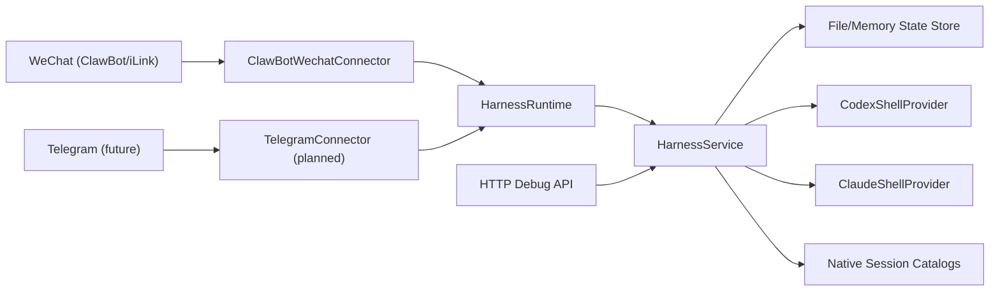

# Agent Context & Handoff (Better Call Codex)

Last updated: 2026-03-23 (local session)

## 1) Project Goal

Build a personal-computer-first multi-channel coding hub that lets Telegram or WeChat talk to local coding agents such as `codex` and `claude`, while keeping:

- explicit workspace selection
- explicit provider selection
- multiple named sessions per workspace
- separate current session per provider inside the same chat binding
- safe local-first operation with dry-run and live modes

Phase 1 target is practical and already underway:

- WeChat is the first real channel
- Codex is the first real live provider
- Telegram real connector is implemented, but still needs real token-based production validation

## 2) Current Architecture

### 2.1 Runtime shape

### 2.2 Core modules

- `src/core/harness-service.ts`
  Main orchestrator for bindings, sessions, workspace selection, provider routing, native session attach/list, and turn execution.
- `src/runtime/harness-runtime.ts`
  Connects one or more channel connectors to the core service and dispatches outbound messages back to the correct connector.
- `src/channels/clawbot-wechat-connector.ts`
  Real WeChat connector using ClawBot/iLink-compatible `getupdates` and `sendmessage`.
- `src/providers/codex-shell-provider.ts`
  Non-interactive Codex runner with `resume <thread_id>` support and JSON event parsing.
- `src/providers/claude-shell-provider.ts`
  Claude shell adapter using persisted session IDs.
- `src/native/codex-session-catalog.ts`
  Local Codex native-session discovery from `~/.codex/sessions`.

### 2.3 Core domain model

- `Workspace`
  Allowlisted local project root with slug and allowed providers.
- `Session`
  Better Call Codex session record tied to one workspace and one provider.
- `ChannelBinding`
  One Telegram or WeChat conversation scope with:
  - selected workspace
  - preferred provider
  - preferred model override per provider
  - current session per provider
  - latest reply context for channel-native replies

### 2.4 Concurrency model

- Same binding: serialized
- Different bindings: allowed to run in parallel
- Shared state persistence: protected through short serialized sections

## 3) Technology Stack

- Language: TypeScript
- Runtime: Node.js 20+
- Module system: ESM
- Dev runner: `tsx`
- Testing: `vitest`
- Persistence: JSON file store + in-memory test store
- Real channel: WeChat via ClawBot/iLink-compatible HTTP API
- Real channel: Telegram via Bot API long polling
- Real provider: Codex CLI
- Optional provider path: Claude CLI

## 4) Current Implementation Status

### 4.1 Implemented

- file-backed and memory-backed state stores
- HTTP debug API
- workspace registration and chat-driven workspace import
- binding-level serialization with cross-binding parallelism
- multiple sessions per workspace/provider
- provider switching and model override commands
- WeChat runtime connector and reply-context handling
- Telegram runtime connector and reply-context handling
- config-based inbound allowlists for WeChat and Telegram
- native Codex session discovery
- native session attach and switch workflow
- Chinese command aliases for WeChat
- detailed WeChat deployment guide

### 4.2 Partially implemented

- Claude provider adapter exists, but real-machine validation depends on local `claude` CLI availability
- model switching is implemented as per-binding model override, not full preset/reasoning-profile management
- native session discovery exists only for Codex, not yet for Claude
- Telegram connector code and tests exist, but real production token verification is still pending
- allowlists are implemented, but richer admin controls are not yet built

### 4.3 Not implemented yet

- auth/admin control commands and runtime allowlist management UX
- provider preset / reasoning profile abstraction
- transcript import / migration from OpenClaw or external systems
- streaming responses / richer partial output UX

## 5) Key Files Index

- App / entry:
  - `package.json`
  - `src/server.ts`
  - `src/index.ts`
  - `src/config.ts`
- Core:
  - `src/core/harness-service.ts`
  - `src/core/command-parser.ts`
- Domain:
  - `src/domain/models.ts`
- Channels / runtime:
  - `src/channels/types.ts`
  - `src/channels/clawbot-wechat-connector.ts`
  - `src/channels/telegram-bot-connector.ts`
  - `src/runtime/harness-runtime.ts`
  - `src/runtime/create-harness-runtime.ts`
- Auth:
  - `src/auth/config-authorizer.ts`
  - `src/auth/types.ts`
- Providers:
  - `src/providers/codex-shell-provider.ts`
  - `src/providers/claude-shell-provider.ts`
- Native session discovery:
  - `src/native/codex-session-catalog.ts`
  - `src/native/types.ts`
- Tests:
  - `tests/harness-service.test.ts`
  - `tests/server.test.ts`
  - `tests/wechat-connector.test.ts`
  - `tests/telegram-connector.test.ts`
  - `tests/runtime.test.ts`
  - `tests/file-state-store.test.ts`
  - `tests/native-session-catalog.test.ts`
- Deployment docs:
  - `docs/WECHAT_DEPLOYMENT.md`

## 6) Validation Status

Current project verification commands:

- `pnpm check`
- `pnpm build`

Latest known state:

- TypeScript typecheck passes
- All current Vitest suites pass
- Real WeChat connectivity has been proven on the local machine
- Native Codex session attach/resume has been proven via command-line test
- Telegram connector logic is covered by tests
- allowlist enforcement is covered by service-level tests

## 7) Suggested Next Tasks (Priority Order)

1. Perform real Telegram token validation and end-to-end connector smoke tests.
2. Add richer auth/admin controls so allowlists can be managed safely at runtime.
3. Add provider presets / reasoning profile commands with real provider-level mappings.
4. Add Claude native-session discovery and attach/list support.
5. Add transcript import and migration helpers from OpenClaw / external agent logs.
6. Add richer delivery UX: streaming, typing signals, retry strategy, observability.
